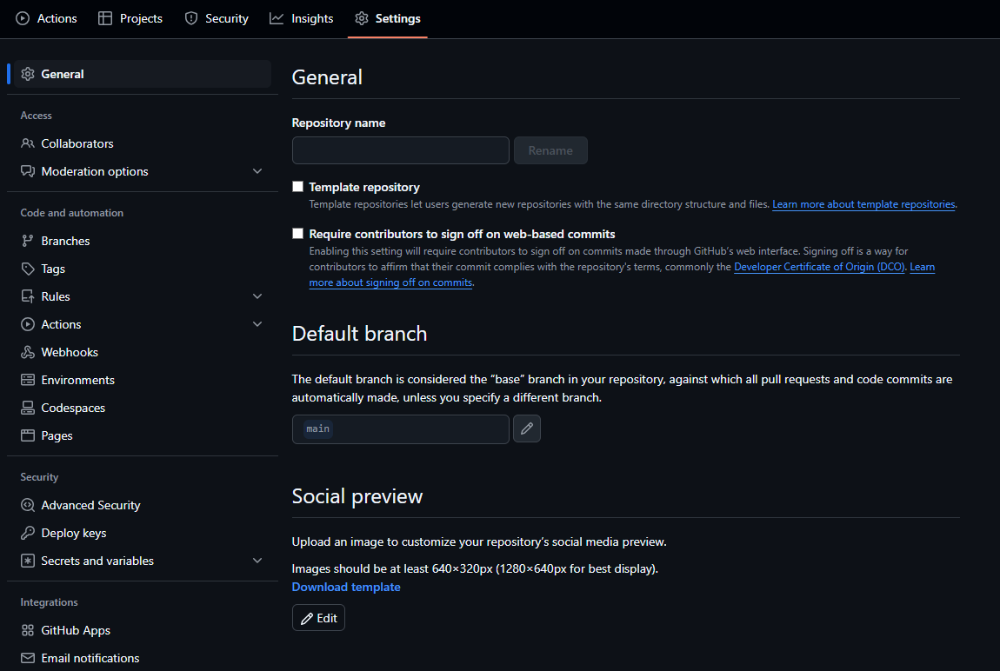

# **Het Overdragen van een GitHub Repository tussen Organisaties**

## **Inleiding**
Deze handleiding legt stap voor stap uit hoe je een repository overdraagt van de ene organisatie naar een andere op GitHub. Dit is handig als je een project verhuist naar een nieuwe organisatie of als je een repository wilt samenvoegen met een ander team. 

> **Let op**: Dit proces is onomkeerbaar, dus zorg ervoor dat je een back-up maakt voordat je begint!

---

## **Wat je nodig hebt**
⭕ Je bent **eigenaar** van de repository die je wilt overdragen.  
⭕ Je bent lid van de **doelorganisatie** met beheerdersrechten.  
⭕ De **doelorganisatie heeft voldoende ruimte** (voor gratis accounts geldt een limiet).  
⭕ Je hebt **toegang tot het internet** en een **webbrowser**.  

---

## **Stap 1: Inloggen op GitHub**
1. Open je browser en ga naar [GitHub](https://github.com/).
2. Klik rechtsboven op **Sign In** en log in met je gebruikersnaam en wachtwoord.

*Referentie: inlogpagina.*

---

## **Stap 2: Ga naar de Repository-instellingen**
1. Klik rechtsboven op je **profielfoto** en kies **Your repositories**.
2. Zoek de repository die je wilt overdragen en klik erop.
3. Klik bovenaan op **Settings** (Instellingen).

*Referentie: instellingenmenu.*

---

## **Stap 3: Start het overdrachtsproces**
1. Scroll helemaal naar beneden tot je bij de sectie **"Danger Zone"** komt.
2. Klik op de knop **"Transfer ownership"** (Eigendom overdragen).  
   *Referentie: Voeg hier een screenshot toe van de "Danger Zone".*
3. Voer de naam van de repository in ter bevestiging.
4. Voer de **naam van de doelorganisatie** in (bijvoorbeeld `NieuweOrganisatie`).
5. Klik op **"I understand, transfer this repository"** om de overdracht te starten.

*Referentie: het overdrachtsscherm.*

---

## **Stap 4: Accepteer de Overdracht (indien nodig)**
- In sommige gevallen moet een beheerder van de nieuwe organisatie de overdracht **bevestigen**.
- GitHub stuurt een melding naar de nieuwe eigenaar of organisatie.
- Zodra de overdracht is voltooid, verschijnt de repository onder de nieuwe organisatie.

*Referentie: de bevestigingsmail of melding.*

---

## **Wat gebeurt er na de overdracht?**
🟢 **Alle code, issues, pull requests en commitgeschiedenis blijven behouden.**  
🟢 **De oude URL blijft tijdelijk doorverwijzen naar de nieuwe locatie.**  
🟢 **De repository-instellingen kunnen veranderen**, dus controleer de permissies en branches opnieuw.

---

## **Veelvoorkomende Problemen & Oplossingen**
| Probleem | Oplossing |
|----------|----------|
| Overdracht mislukt | Controleer of je de eigenaar bent van de repository. |
| Doelorganisatie verschijnt niet | Zorg ervoor dat je lid bent van de organisatie met beheerdersrechten. |
| Repository-limiet bereikt | Upgrade het abonnement van de organisatie of verwijder oude repositories. |
| Ik kan de oude URL niet meer gebruiken | Werk documentatie en integraties bij naar de nieuwe repository-URL. |

---

## **Conclusie**
Gefeliciteerd! Je hebt succesvol een repository overgedragen naar een andere organisatie op GitHub. Vergeet niet je teamleden op de hoogte te stellen en je documentatie bij te werken.

---

🟡 **Tip:** Wil je controleren of alles goed is gegaan? Ga naar de nieuwe repository en bekijk de instellingen en gebruikersrechten!  
