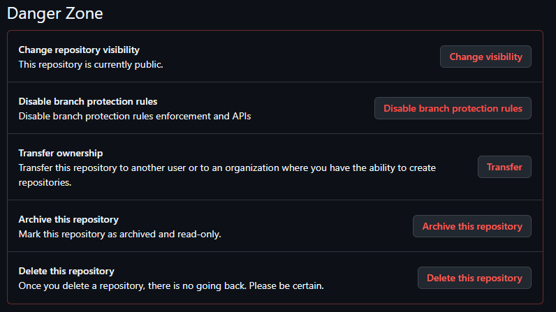

# **Transférer un dépôt GitHub entre organisations**

## **Introduction**
Ce guide explique, étape par étape, comment transférer un dépôt d’une organisation à une autre sur GitHub. Ceci est utile lors du déplacement d’un projet vers une nouvelle organisation ou pour fusionner des dépôts dans une autre équipe.

> **Remarque** : Ce processus est irréversible, assurez-vous de créer une sauvegarde avant de commencer !

---

## **Pré-requis**
⭕ Vous êtes le **propriétaire** du dépôt que vous souhaitez transférer.  
⭕ Vous êtes membre de l’**organisation cible** avec des droits d’administration.  
⭕ L’**organisation cible a suffisamment d’espace** (les comptes gratuits ont des limitations).  
⭕ Vous avez **accès à Internet** et un **navigateur Web**.  

---

## **Étape 1 : Connexion à GitHub**
1. Ouvrez votre navigateur et allez sur [GitHub](https://github.com/).
2. Cliquez sur **Sign In** en haut à droite et connectez-vous avec votre nom d’utilisateur et votre mot de passe.

*Référence : la page de connexion.*

---

## **Étape 2 : Accéder aux paramètres du dépôt**
1. Cliquez sur votre **photo de profil** en haut à droite et sélectionnez **Your repositories**.
2. Trouvez le dépôt que vous souhaitez transférer et cliquez dessus.
3. Cliquez sur **Settings** en haut.

*Référence : paramètres.*

---

## **Étape 3 : Lancer le processus de transfert**
1. Faites défiler vers le bas jusqu’à la section **"Danger Zone"**.
2. Cliquez sur **"Transfer ownership"**.
   *Référence : Ajoutez ici une capture d’écran de la "Danger Zone".*
3. Saisissez le nom du dépôt pour confirmer.
4. Entrez le **nom de l’organisation cible** (ex : `NouvelleOrganisation`).
5. Cliquez sur **"I understand, transfer this repository"** pour lancer le transfert.

*Référence : transfert.*

---

## **Étape 4 : Accepter le transfert (si nécessaire)**
- Dans certains cas, un administrateur de la nouvelle organisation doit **approuver** le transfert.
- GitHub enverra une notification au nouveau propriétaire ou à l’organisation.
- Une fois le transfert terminé, le dépôt apparaîtra sous la nouvelle organisation.

*Référence : la notification de confirmation.*

---

## **Que se passe-t-il après le transfert ?**
🟢 **Tout le code, les issues, les pull requests et l’historique des commits restent intacts.**  
🟢 **L’ancienne URL redirigera temporairement vers la nouvelle.**  
🟢 **Les paramètres du dépôt peuvent changer**, il est donc recommandé de vérifier les permissions et les branches.

---

## **Problèmes courants et solutions**
| Problème | Solution |
|----------|----------|
| Le transfert a échoué | Assurez-vous d’être le propriétaire du dépôt. |
| L’organisation cible n’apparaît pas | Vérifiez que vous êtes membre de l’organisation avec des droits d’administration. |
| Limite du nombre de dépôts atteinte | Mettez à niveau l’abonnement de l’organisation ou supprimez d’anciens dépôts. |
| L’ancienne URL ne fonctionne plus | Mettez à jour la documentation et les intégrations pour utiliser la nouvelle URL du dépôt. |

---

## **Conclusion**
Félicitations ! 🎉 Vous avez transféré avec succès un dépôt vers une autre organisation sur GitHub. Assurez-vous d’informer votre équipe et de mettre à jour votre documentation.

---

🟡 **Astuce :** Vous voulez vérifier que tout est correctement configuré ? Allez sur le nouveau dépôt et examinez les paramètres et les permissions !  
